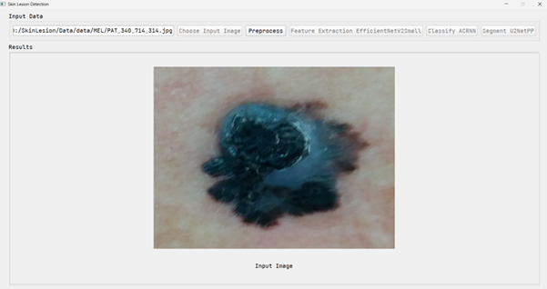
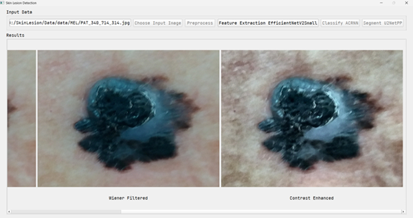
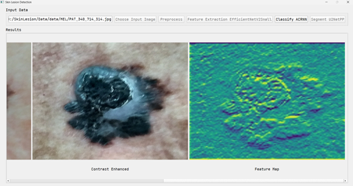
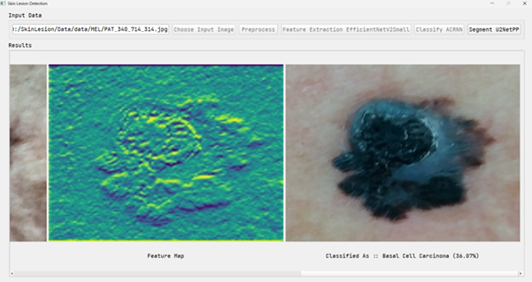
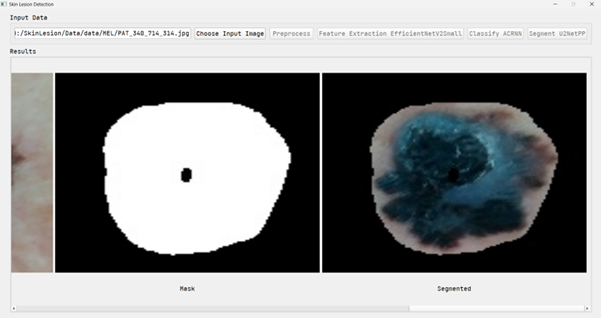

# SkinProNet
SkinProNet is an AI-driven software tool that performs classification and segmentation of skin lesions using a novel hybrid deep learning architecture. The tool integrates preprocessing techniques, EfficientNetV2Small for feature extraction, Optimized ACRNN for classification, and U²-Net++ for segmentation. 
## 📦 Download Dataset

You can download the full dataset here:

👉 https://drive.google.com/drive/folders/1fcPcl7pXIb2UzDQ7m-qFIo0y_-MxCds-?usp=sharing

This project includes a GUI-based pipeline for automated skin lesion detection and classification, with each stage illustrated below.

1. 🖼️ Image Selection
The user selects a dermoscopic image from the dataset through a file dialog interface. The selected image is loaded for processing.

2. 📥 Image Preprocessing
The selected input image is displayed before undergoing any transformation. This step prepares the image for enhancement and feature extraction.

3. 🎨 Feature Enhancement
The image undergoes preprocessing:
Left: Wiener filter for noise reduction
Right: Contrast enhancement to highlight lesion boundaries and features

4. 📊 Feature Map Generation
Using EfficientNetV2S and ACRNN classifier:
Left: Enhanced input image
Right: Feature map visualization from the CNN layer output

5. 🧠 Disease Classification
Left: Feature Map
Right: Final classification result
Output: Classified as: Basal Cell Carcinoma (Confidence: 36.07%)

6. ✂️ Lesion Segmentation
Using U2NetPP for segmentation:
Left: Binary segmentation mask
Right: Segmented lesion overlayed on the original image

These screenshots demonstrate the end-to-end workflow of the software:
Load → 2. Preprocess → 3. Enhance → 4. Extract Features → 5. Classify → 6. Segment
Each step is executed via the GUI with clear visual feedback, making the system intuitive and user-friendly for clinical or research use.

