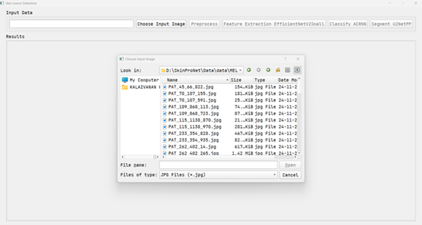

# SkinProNet
SkinProNet is an AI-driven software tool that performs classification and segmentation of skin lesions using a novel hybrid deep learning architecture. The tool integrates preprocessing techniques, EfficientNetV2Small for feature extraction, Optimized ACRNN for classification, and U²-Net++ for segmentation. 
## 📦 Download Dataset

You can download the full dataset here:

👉 https://drive.google.com/drive/folders/1fcPcl7pXIb2UzDQ7m-qFIo0y_-MxCds-?usp=sharing

1. 🖼️ Image Selection

The user selects a dermoscopic image from the dataset through a file dialog interface. The selected image is loaded for processing.

